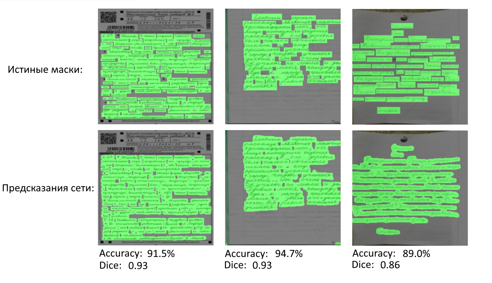

Данный проект решает задачу сегментации рукописного текста на изображении. На вход модели идёт изображение, с присутствующим на нём рукописным текстом, а на выходе выдаётся черно-белая маска, где чёрным цветом сегментируется область без рукописного текста, а белым - область с рукописным текстом. 

Примеры работы сети:

ссылка на wandb: https://wandb.ai/emorh/segmentation%20project?workspace=user-emorh